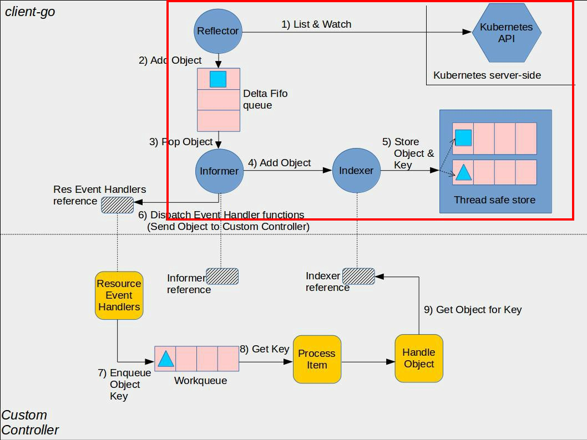

# controllercache

[](https://codecov.io/gh/yylt/controllercache)
[](https://goreportcard.com/report/github.com/yylt/controllercache)
[](https://pkg.go.dev/github.com/yylt/controllercache?tab=doc)


controllercache is mainly used as a kubernetes cache and is implemented in the red box below




## controller-runtime
- use default [controller-runtime](https://github.com/kubernetes-sigs/controller-runtime)
- from [controller-runtime](https://github.com/kubernetes-sigs/controller-runtime) version v0.15.0, that support set cache for client, so this project is not maintained forever.

```
package main

import (
	"context"
	"flag"

	corev1 "k8s.io/api/core/v1"
	apierrors "k8s.io/apimachinery/pkg/api/errors"
	metav1 "k8s.io/apimachinery/pkg/apis/meta/v1"
	"k8s.io/apimachinery/pkg/runtime"
	utilruntime "k8s.io/apimachinery/pkg/util/runtime"
	clientgoscheme "k8s.io/client-go/kubernetes/scheme"
	ctrl "sigs.k8s.io/controller-runtime"
	"sigs.k8s.io/controller-runtime/pkg/cache"
	"sigs.k8s.io/controller-runtime/pkg/client"
)

var (
	scheme *runtime.Scheme
)

func init() {
	utilruntime.Must(clientgoscheme.AddToScheme(scheme))
}

func main() {
	// parse kubeconfig option
	flag.Parse()

	// create cache client
	cachecli, err := cache.New(ctrl.GetConfigOrDie(), cache.Options{
		Scheme: scheme,
		ByObject: map[client.Object]cache.ByObject{
			&corev1.Namespace{}: {},
		},
	})
	if err != nil {
		panic(err)
	}

	cacheopt := &client.CacheOptions{
		Reader: cachecli,
	}

	cli, err := client.New(ctrl.GetConfigOrDie(), client.Options{
		Scheme: scheme,
		Cache:  cacheopt,
	})
	if err != nil {
		panic(err)
	}

	in := &corev1.Namespace{
		ObjectMeta: metav1.ObjectMeta{
			Name: "default",
		},
	}
	// cache read namespace
	if err = cli.Get(context.Background(), client.ObjectKeyFromObject(in), in); err != nil {
		if !apierrors.IsNotFound(err) {
			panic(err)
		}
	}
}

```

## install

To install Gin package, you need to install Go and set your Go workspace first.

1. The first need [Go](https://golang.org/) installed (**version 1.16+ is required**)

```sh
$ go get -u github.com/yylt/controllercache
```

1. Import it in your code:

```go
import "github.com/yylt/controllercache"
```

## Quick start

```sh
# assume the following codes in example.go file
$ cat example/get/example.go
```

```go
package main

import (
    "fmt"
    "k8s.io/client-go/tools/clientcmd"
    "github.com/yylt/controllercache"
    corev1 "k8s.io/api/core/v1"
)

func main() {
	kubeconfig := flag.String("kubeconfig", "", "kubeconfig path")
	flag.Parse()
	config, err := clientcmd.BuildConfigFromFlags("", *kubeconfig)
    if err != nil {
        panic(err)
    }

    var n = &corev1.Node{}
    reader.CacheForObject(n, "")
    reader.Get(context.TODO(), types.NamespacedName{
        Name: "default",
    }, n)
    fmt.Printf("namespace default: %v\n", n)
}
```
